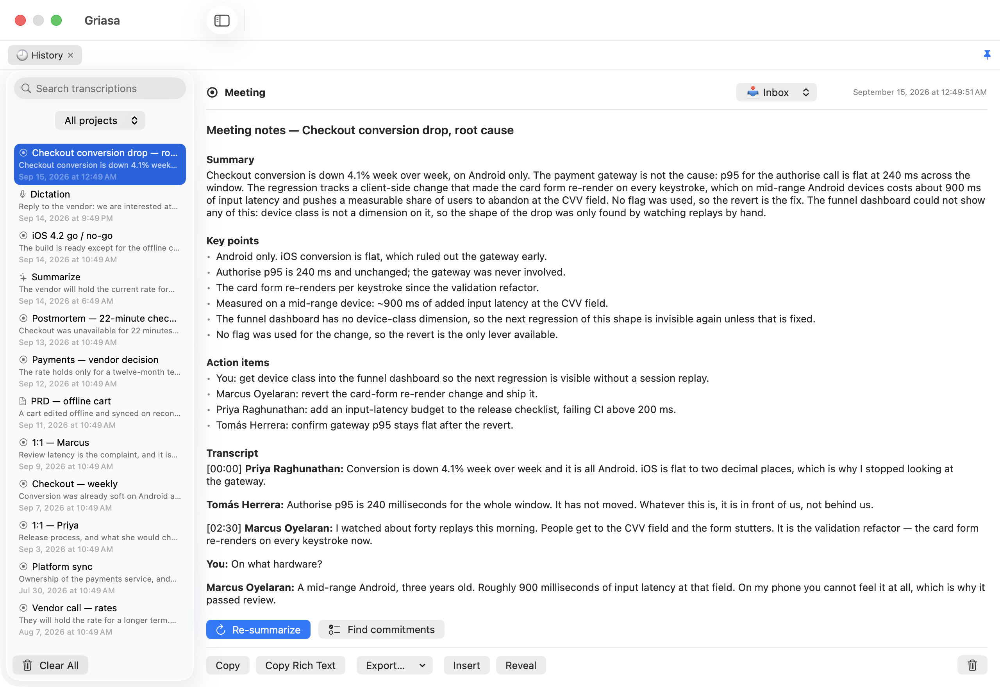
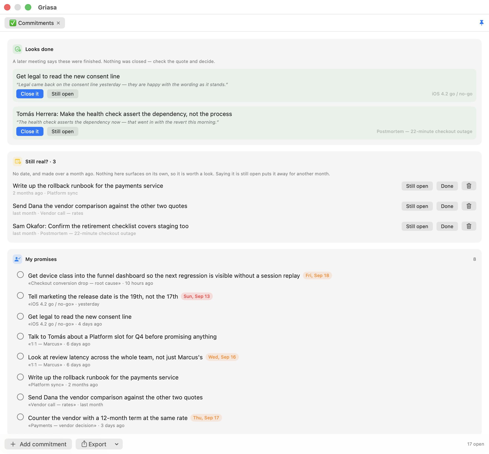
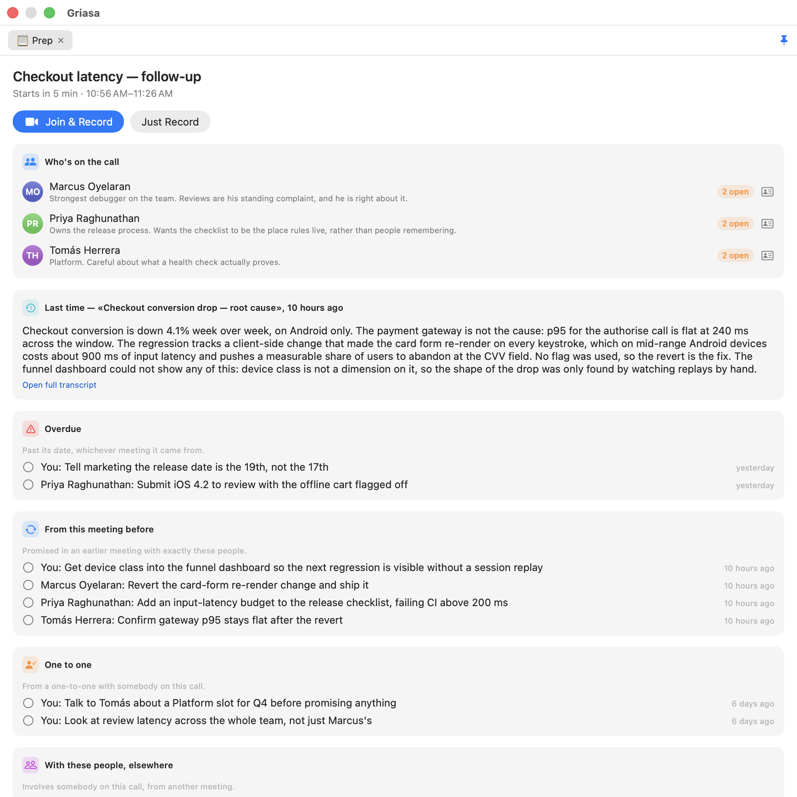

# Griasa — system-wide dictation + conversation recorder for macOS

A native menu-bar app (Swift/SwiftUI, no dependencies) with two modes:

1. **Dictation** — hold a hotkey, speak, release: your speech is transcribed on-device, cleaned up by AI (filler words removed, punctuation fixed, tone matched to the app you're typing into), and inserted at the cursor of whatever app is frontmost.
2. **Conversation recording** — records your microphone **and** everything the Mac plays (the other side of a Zoom/Meet/FaceTime call, videos, etc.) into timestamped session folders, with automatic transcripts when the session ends.

Both modes can run at the same time — you can dictate while a conversation is being recorded.

Made for anyone tired of installing a separate app for every small thing — and paying each one its own subscription.

## Download

**[Download the latest release — signed, notarized, universal](https://github.com/Stari-am/griasa/releases/latest)** · [what it does and what building it took](https://stari-am.github.io/griasa/)

Free, and nothing is held back: there is no license check, and under GPL-3.0 there could not be a meaningful one. If it saves you time, [$29 on Ko-fi would make my day — any amount does](https://ko-fi.com/griasa), and none is fine too.

Think of it the way you think of WinRAR: the trial never ends and it keeps working whether or not you pay. WinRAR apparently makes real money like that, which leaves the mystery nobody has solved in thirty years — *somebody* pays. Feel free to be one of the somebodies.



*One recorded meeting after it ended. Nothing in that pane was typed by hand.*



*The same meetings read a different way: what you owe, and what you are owed.*



*Five minutes before a call, without taking keyboard focus. Built from local data only.*

## How dictation behaves

| | |
|---|---|
| Trigger | Hold Right Option / Right Command / Fn (configurable) — works in any app's text field |
| Insertion | Live typing as you speak, then a single corrected replacement on release |
| Auto edits | Filler words removed, punctuation restored, lists formatted, self-corrections resolved |
| Tone | The frontmost app's name is passed to the AI prompt, so Slack reads casual and Mail reads formal |
| Speech recognition | On-device (Apple recognizer, or whisper.cpp locally) — audio never leaves the Mac |
| Cloud usage | Only the short *cleanup* step may call an LLM, and only text, and only if you enable it |
| Languages | Any locale the system offers; two or three at a time run as parallel legs and the winner is locked in |
| Snippets | Typed abbreviations expand in place, including `;ai … ;;` for an inline question |

## Build & run

```sh
./build.sh        # produces Griasa.app (local dev build)
open Griasa.app
./test.sh         # the invariant checks; release.sh runs these first
```

A local build announces itself: amber **DEV** icon, "Griasa Dev" as its name in
Privacy settings and Activity Monitor, and a squared-off menu-bar glyph. Both
builds keep the same bundle identifier on purpose — that is what preserves your
privacy grants — which is exactly why the local one has to be recognizable some
other way. `release.sh` does none of it; the signed build carries the real icon
and the real name.

`test.sh` checks the rules live typing must never break — emitted text only ever
grows, a hypothesis that re-words the start of an utterance may not extend its end,
the language leg locks once. The first two were regressions that actually shipped;
they now fail a command instead of a text field. There is no test framework involved: `swiftc` compiles
`PartialStabilizer.swift` with the checks and the binary exits non-zero, so this
works on a machine with only the Command Line Tools. Each failure message states
the rule and why it matters, because "expected true, got false" tells whoever reads
it nothing.

## Distribute it yourself

```sh
./release.sh      # signed + notarized dist/Griasa-<version>.dmg — the one on Releases
./dist.sh         # ad-hoc signed dmg, no Apple account needed
```

`release.sh` is the path used for the published build: Developer ID signature, Hardened Runtime, Apple's notarization ticket stapled to **both** the app and the disk image, then verified the way a stranger's Mac will — `spctl`, `stapler`, and `lipo -archs` on the finished file rather than on the build settings. It needs a `Developer ID Application` certificate and a stored `notarytool` credential; run it without them and its preflight explains exactly what to create, including the two traps that cost the most time (importing the certificate with `security import` because a double-click reports `-25294`, and installing the G2 intermediate separately or `codesign` dies with "unable to build chain to self-signed root").

`dist.sh` is for handing a build to a colleague with no Apple Developer account: a **universal** dmg with an app icon, an `/Applications` shortcut, and `INSTALL.txt`. Being ad-hoc signed, recipients must **right-click → Open** once. Either way the rest is self-provisioning: on first launch the app installs whisper-cpp via Homebrew, downloads the model, and asks for the four permissions.

Builds on macOS 14+ with either full Xcode or the standalone Command Line Tools; runs on macOS 14+. `build.sh` compiles with `swiftc` directly, which needs no working SwiftPM — some standalone Command Line Tools installs ship a broken manifest library. `Package.swift` is equivalent and `swift build` works under full Xcode; use whichever you prefer.

**Intel builds have a deadline.** Xcode 26 is the last release that runs on Intel Macs and the last that gives you `x86_64` for free. Under Xcode 27, a deployment target of 27.0 or later drops `x86_64` from `ARCHS_STANDARD` silently — no error, just an arm64-only binary — and Intel software support ends altogether in macOS 28. This project targets macOS 14.0, so `release.sh` still produces a genuine universal binary; it verifies with `lipo -archs` rather than trusting the build settings, and you should keep doing that if you ever raise the target.

## Contributing

Patches welcome, and so is a fork. [CONTRIBUTING.md](CONTRIBUTING.md) covers the
build, the invariant checks, and the handful of conventions a patch is most likely
to trip over — where prompts live, why new UI is a hub tab rather than a window,
and why screenshots must never be taken against real data.

## Make it yours (forks & custom builds)

Everything that identifies *whose* build this is lives in **one file**: [`Sources/Griasa/BuildConfig.swift`](Sources/Griasa/BuildConfig.swift). Edit it before building:

| Constant | What it drives | If left empty |
|---|---|---|
| `supportEmail` | "Send Feedback" mail drafts | feedback buttons hidden |
| `donateURL` | the ♥ donate button | donate buttons hidden |
| `updateRepo` | daily update check against `github.com/<owner>/<name>` Releases | update checking off |
| `appName` | mail subjects and version lines | — |

Code signing is parameterized via environment variables — no script edits needed:

```sh
CODESIGN_IDENTITY="My Own Cert" ./build.sh                       # dev build (default: "Griasa Dev Signing")
DIST_SIGN_IDENTITY="Developer ID Application: You (TEAM)" ./dist.sh  # distributable (default: ad-hoc)
```

Bundle identifier and version live in `Support/Info.plist` — change `CFBundleIdentifier` if you distribute a fork, so your permission grants and update feed never collide with upstream builds.

### Changing what the AI is told

Every system prompt Griasa sends to a model is in **one file**: [`Sources/Griasa/Prompts.swift`](Sources/Griasa/Prompts.swift) — dictation cleanup, meeting notes, commitment extraction, colleague dossiers, project filing, document drafting, reminder parsing, chat replies, inline answers. Reading that file is enough to know exactly what the app asks a model to do; edit it and rebuild to change the app's behavior.

Runtime values are written `{{placeholder}}` and filled by the call site — `{{today}}`, `{{participants}}`, `{{skeleton}}` and so on. A placeholder the caller doesn't supply is left visible in the prompt rather than silently blanked, so a mistake shows up in the output instead of hiding.

You don't have to rebuild to experiment: **Settings → AI & Actions → System prompts → Export for editing** writes the current wording to `~/Documents/Griasa Prompts.json`. Any key present there overrides the built-in version; delete a key (or the file) to go back. **Reload edits** picks up changes without a restart.

The prompt-preset library (Settings → Prompt presets) is deliberately *not* in that file — those are your own documents, edited in the UI and stored per user, not app behavior.

> Always run the **bundled app** (`Griasa.app`), not the bare binary — macOS permission prompts (mic, speech) need the Info.plist in the bundle.

### Permissions (one-time)

On first launch Griasa asks for everything it needs. If a prompt doesn't appear, grant manually in **System Settings → Privacy & Security**:

| Permission | Used for |
|---|---|
| Microphone | dictation + recording |
| Speech Recognition | on-device transcription |
| Accessibility | global hotkey + inserting text (⌘V synthesis) |
| Screen Recording | system-audio capture (macOS gates app audio behind this) |

After granting Accessibility or Screen Recording, quit and relaunch Griasa.

**Signing & permission stability**: macOS ties privacy grants to the app's code signature. `build.sh` signs with a local self-signed certificate ("Griasa Dev Signing", created once in the login keychain), so the identity — and your permission grants — survive rebuilds. If that certificate is missing, the script falls back to ad-hoc signing and warns you (with ad-hoc, every rebuild looks like a new app and permissions reset). To recreate the certificate: generate a self-signed cert with the codeSigning EKU, import the `.p12` (legacy format) into the login keychain, and `security add-trusted-cert -r trustRoot -p codeSign` it. If permissions ever get into a confused state, clear them with `tccutil reset All am.stari.griasa` and re-grant once.

## Using it

### Dictation
1. Click into any text field in any app.
2. **Hold Right Option (⌥)** — the menu-bar mic fills in.
3. Speak — **words appear live at your cursor as you talk** (instant on-device recognizer).
4. Release the key — the live text is corrected in place with the polished Whisper + AI-cleaned version (only the differing tail is rewritten, via a diff of synthetic keystrokes).

Live typing can be turned off in Settings → Dictation (then everything is pasted once at the end) — useful in apps where synthetic keystrokes misbehave (e.g. fields with aggressive autocomplete).

Griasa keeps a lifetime **time-saved counter** (words dictated × the 40 wpm-typing vs 150 wpm-speaking gap) in the menu-bar panel and Settings → System.

On first launch a **Welcome guide** opens in the hub: quick start plus a live checklist of the three system permissions, each with a one-click jump to the right System Settings pane and a note on what still works if you decline. Reopen it anytime from Settings → System.

AI cleanup uses the configured **AI provider** (see below). Without one — or if the call fails — a local rule-based cleanup runs instead, so dictation always works offline.

### AI providers — Anthropic, OpenAI, Gemini, your existing subscription, or fully local
Every AI feature routes through one configurable provider (Settings → AI & Actions):

- **Anthropic (Claude)** — the default. Key from Settings or `ANTHROPIC_API_KEY`.
- **OpenAI** — key from Settings or `OPENAI_API_KEY` (GPT-5.6 family by default).
- **Google (Gemini)** — key from Settings or `GEMINI_API_KEY` (via Google's OpenAI-compatible endpoint; Gemini 3.x by default).
- **Custom / local** — any **OpenAI-compatible endpoint** by base URL: Ollama (`http://localhost:11434/v1`, no key), LM Studio, OpenRouter, Groq… With Ollama + the built-in local Whisper, Griasa runs **fully offline** — no text ever leaves the Mac.
- **Claude Code (subscription)** / **Codex CLI (ChatGPT subscription)** — **no API key at all**: if the `claude` or `codex` CLI is installed and logged in, Griasa answers through it, billed to the subscription you already pay for. Auto-detected (with an optional path override); expect ~5–10 s per request — great for meeting notes, dossiers, and documents, slower than an API key for typing-path features like `;tldr`. ([CLIRunner.swift](Sources/Griasa/CLIRunner.swift))

Each provider has a **fast** model (dictation cleanup, reminder parsing, classification, reply drafts) and a **smart** model (presets, summaries, Ask Project, meeting notes); defaults are sensible (Haiku 4.5/Opus 4.8, GPT-5.6 Luna/Terra, Gemini 3.1 Flash-Lite/3.5 Flash, Qwen3 8B/30B) and editable — for local endpoints a **Load model list** button offers what's actually installed, and **Test** pings the provider and reports latency. Meeting transcripts are trimmed to a configurable context budget on local models (default 24k chars; cloud models get 400k). If the selected provider fails and a cloud key is also configured, explicit actions **ask** before re-sending the text through the cloud ("ask each time", with an *until restart* option); dictation cleanup and background classification never ask — they degrade silently. ([LLMProvider.swift](Sources/Griasa/LLMProvider.swift), [AIFormatter.swift](Sources/Griasa/AIFormatter.swift))

### Speech engines
Griasa prefers **Whisper (whisper.cpp, large-v3-turbo)** — dramatically more accurate than Apple's recognizer, fully local, with genuine automatic language detection built into the model.

**Setup is automatic on first launch**: the app installs `whisper-cpp` via Homebrew (if missing) and downloads the 1.6 GB model to `~/Library/Application Support/Griasa/`, showing progress in the menu-bar menu and in Settings → Speech engine (with a Retry button if anything fails). Only Homebrew itself is assumed; without it the app tells you and keeps working on the Apple engine. Manual equivalent:

```sh
brew install whisper-cpp
curl -L -o ~/Library/Application\ Support/Griasa/ggml-large-v3-turbo.bin \
  https://huggingface.co/ggerganov/whisper.cpp/resolve/main/ggml-large-v3-turbo.bin
```

Griasa keeps a local **`whisper-server`** running with the model loaded, so dictation transcribes near-instantly on hotkey release and meeting regions don't pay a per-call model load. When whisper-cli or the model is missing, everything falls back to the Apple recognizer.

**Correct timeline on meetings**: whisper.cpp's built-in `--vad` concatenates speech chunks and re-times them continuously, so text after long pauses drifts earlier (upstream [issue #3634](https://github.com/ggml-org/whisper.cpp/issues/3634)). Griasa avoids this by running Silero VAD itself (`whisper-vad-speech-segments`), slicing each speech region out of the audio, transcribing regions individually against the warm server, and stamping each with its true start time — segments stay in real chronological order even across long silences. A headless mode re-runs the pipeline on any past recording: `./Griasa.app/Contents/MacOS/Griasa --transcribe "<recording folder>"`.

### Automatic language detection
- **Whisper**: language detection is native to the model (`-l auto`) — nothing to configure.
- **Apple fallback**: Apple's recognizer needs a fixed locale per request, so Griasa runs one recognizer **per configured language in parallel** (Settings → Dictation → Languages, default `en-US, ru-RU`) and keeps the transcription with the highest confidence score — per phrase for dictation, per 30-second chunk for meetings.

Mixed-in **English tech/crypto terms** are handled two ways:
- A built-in vocabulary ([Vocabulary.swift](Sources/Griasa/Vocabulary.swift): GitHub, deploy, staking, jetton, seed phrase, mainnet…) plus your own terms from Settings is fed to Whisper as an initial prompt and to Apple recognizers as contextual hints.
- The cleanup prompt instructs the model to keep English terms untranslated and to fix phonetically transliterated ones ("гит хаб" → "GitHub") while never translating the rest of the text.

### Prompt presets on selected text (any app)
Select text anywhere — browser, Slack, PDF — and apply a **prompt preset** from the menu or its hotkey. Ships with Summarize (⌃⌥⌘S), Fix grammar (⌃⌥⌘G), Translate to English, Make it professional, To bullet points, and Rewrite as commit message. Editable presets that rewrite the text (grammar, translate…) show a *Replace Selection* button; summaries don't.

**Add your own** in Settings → AI & Actions: name, emoji, the instruction to the model, whether it replaces the selection, and an optional hotkey. Defaults use the triple-modifier ⌃⌥⌘ because global hotkeys on macOS can't be swallowed — the frontmost app also receives the keystroke, so the combo must be one no app binds. Griasa waits for you to release the modifiers before reading the selection (synthesizing ⌘C while modifiers are held can reach some apps as plain text and wipe the selection); your clipboard is saved and restored.

### History & export
Every dictation, meeting transcript, and preset result is saved to a searchable **History** window (menu → History…). Search full text, then Copy, Insert, Reveal File, or **Export**. Stored locally in `~/Library/Application Support/Griasa/history.json` (last 500 entries).

**Export** (from History and from any result popup) needs no external service or auth:
- **Save As…** → Markdown (`.md`), PDF, HTML, RTF, or plain text.
- **Copy as Rich Text** → paste formatted (headings, bold, bullets) straight into Google Docs, Notion, Confluence, Word, or Slack.

Markdown imports cleanly into Notion/Obsidian/GitHub; HTML and RTF paste with formatting into Docs/Confluence; PDF is print-ready. ([Exporter.swift](Sources/Griasa/Exporter.swift) — a small dependency-free Markdown→HTML converter feeds macOS's rich-text and print systems.)

### Capture (any app)
Four system-wide actions, each with a menu item and a configurable hotkey (Settings → Capture):

- **⏰ Remind me** (⌃⌥⌘R) — from selected text, or drag a screen region if nothing is selected. A Slack-style menu pops up at the cursor: **In 20 minutes / In 1 hour / In 3 hours / Tomorrow 9:00 / Next week Mon 9:00 / Custom… (date picker)**, plus *From the text* where the model reads the due date out of the text itself ("завтра в 3", "in 2 hours"). Fixed times work without an API key. The reminder lands in the **Reminders app**, so it syncs to your iPhone/Watch. Every reminder records **where it came from**: the source app and window title (Slack workspace/channel, Telegram chat) in the notes, and for browsers the tab URL with a scroll-to-text anchor to the captured text — attached as the reminder's link, one click back to the exact spot. Region-drag reminders also save the clipped image to `Documents/Griasa/Reminders/` and link it from the reminder (EventKit can't attach files directly), so you keep the pixels, not just the OCR text. ([ReminderSource.swift](Sources/Griasa/ReminderSource.swift); browser URLs need a one-time Automation permission per browser.)
- **🔤 OCR region** (⌃⌥⌘O) — drag a rectangle; the text inside is recognized on-device (Apple Vision, RU+EN, offline) and copied to your clipboard. Works on images, PDFs, and someone else's shared screen.
- **💬 Draft reply** (⌃⌥⌘Y) — reads the frontmost chat window via OCR and drafts a contextual reply in the thread's language and tone. Universal: Telegram, Slack, Gmail, any app. *Replace Selection* pastes it back.
- **Run on clipboard** (menu) — run any prompt preset against the current clipboard contents, no selection needed.
- **✂️ Snippets** — type an abbreviation (`;meet`, `;sig`) in any app and it expands in place, or insert from the menu. Templates support **dynamic placeholders** resolved at insert time: `{date}` `{date+3d}` `{time}` `{clipboard}` `{meetlink}` (your permanent Zoom/Meet room from Settings), `{slot}` / `{slots:3}` (the nearest free slots from your calendar — read-only EventKit, work hours configurable), `{commitments}` / `{commitments:mine}` / `{commitments:theirs}` (open promises from the Commitments tab as bullet points with the source meeting, date, and due date — `;todos` pastes yours into any status update), and `{ai: instruction}`. The default `;meet` produces e.g. *"Would Tue 21 Jul, 15:00 work for you? Here's my room: …"*. Settings → Snippets.
- **✨ `;ai … ;;` — ask without leaving the sentence.** Type `;ai` in any app, write the question, close it with `;;`, and the whole run is replaced in place by the answer: `;ai как по-английски "предварительный расчёт";;`. No snippet to set up — it's built in, and it reads everything between the markers, so the question can be as long as you like. Escape or moving the caret cancels; if the model fails, your typed text comes back untouched. ([SnippetExpander.swift](Sources/Griasa/SnippetExpander.swift))
- **✨ `{ai:}` — an AI you can type into any text field.** The `{ai: instruction}` placeholder inserts whatever the model writes, right where your cursor is — and placeholders **nest**, so the prompt can see live context: `;tldr` expands `{ai: Summarize in 3 bullets: {clipboard}}` into a summary of whatever you copied, `;en` translates the clipboard into English, and a one-line custom snippet turns any repeated writing task (polite decline, standup opener, commit-message style) into three keystrokes. Works in Slack, Jira, code reviews — anywhere text goes. (Draws on the model's knowledge and your local context; it doesn't browse the web.)

Screen/window capture reuses the Screen Recording permission; Remind asks once for Reminders access. ([CaptureController.swift](Sources/Griasa/CaptureController.swift), [OCR.swift](Sources/Griasa/OCR.swift), [RegionCapture.swift](Sources/Griasa/RegionCapture.swift), [WindowCapture.swift](Sources/Griasa/WindowCapture.swift), [Reminders.swift](Sources/Griasa/Reminders.swift))

### For the remote lead: commitments, people, meeting prep, documents

- **✅ Commitments** — after every recorded meeting, the promises made on the call are extracted quietly (who took what on, and by when — "by Friday" becomes a real due-date chip) and land in the Commitments tab, split into **My promises** and **Waiting on others**. Check items off, send any one to Apple Reminders with a click (it'll ping your iPhone), or add one by hand; the source meeting is one click away. The menu-bar item shows how many are open. **Export** copies the open list as a Markdown checklist (Notion/Obsidian/GitHub) or as one clean task per line — Todoist, Things, and Linear turn a multi-line paste into individual tasks, due dates included. The `;todos` snippet pastes your open promises anywhere you're typing. ([Commitments.swift](Sources/Griasa/Commitments.swift))
- **📇 People** — a page per colleague, built from the meetings roster with zero setup: your free-form notes (autosaved), every meeting you've had with them, their open promises, and an on-demand **AI dossier** — role and ownership, follow-through, working style, recent topics — written from the transcripts they appear in. ([People.swift](Sources/Griasa/People.swift), [PeopleView.swift](Sources/Griasa/PeopleView.swift))
- **📋 Meeting prep** — a few minutes before a calendar event with participants or a call link (lead time configurable, Settings → Meetings), the Prep tab slides in **without stealing your keyboard focus**: who's on the call (with your notes and their open-promise counts), what last meeting with these people was about, what you promised them and they promised you — and a **Join & Record** button that opens the Zoom/Meet/Teams link and starts recording in one go. Also on demand: menu → *Prep Next Meeting*. ([MeetingPrep.swift](Sources/Griasa/MeetingPrep.swift))
- **📄 New Document** — pick a template (PRD, RFC, One-pager, Postmortem — all editable, add your own in Settings → AI & Actions), talk or paste a brief, and the smart model fills the template's sections. Where the brief is silent it writes an honest *TBD* with the question that would fill it — it never invents facts. The result is editable in place, copies with a click, and saves to History where it's auto-filed into a project. ([DocTemplates.swift](Sources/Griasa/DocTemplates.swift))

### Projects (organize everything + ask questions about it)
Every history entry — dictation, meeting, capture result — is filed into a **project** automatically: the fast model matches the entry against each project's name and description (Settings → Projects), falling back to **Inbox** when unsure or offline. Re-assign any entry from the History window (project picker in the detail pane, filter in the sidebar), and run **Categorize existing history** once to file everything recorded before the feature existed.

Each project is mirrored on disk as plain Markdown: `~/Documents/Griasa/Projects/<Project>/YYYY-MM-DD-HHmm-<kind>-<id>.md` with YAML frontmatter — browsable, git/Obsidian-friendly, and never deleted (removing a project moves its files to Inbox).

**🗂 Ask project** (⌃⌥⌘P or menu) opens a window where the smart model answers questions using the project's entries **plus attached source folders** as context — attach a repo, a docs folder, anything; text files are read newest-entries-first up to ~150k characters. Answers are saved back into the project's history. ([Projects.swift](Sources/Griasa/Projects.swift), [ProjectFiles.swift](Sources/Griasa/ProjectFiles.swift), [ProjectAI.swift](Sources/Griasa/ProjectAI.swift), [AskProjectWindow.swift](Sources/Griasa/AskProjectWindow.swift))

### Live notes during a call
Enable *Show live notes while recording* (Settings → Meetings). While a recording runs, the hub's **Recording tab** transcribes both tracks in ~18-second chunks against the warm Whisper server and shows a **running summary** (headline, key points, open questions, action items). The summary refreshes every minute when the **Auto** toggle is on, or only when you press **⟳ Summarize now** — your choice. Below the transcript there's a **note field**: anything you type is pinned into the transcript at the current timecode (📝 rows), fed to the live summary as high-signal input, and woven into the final meeting notes — the model reflects your notes in the Summary/Key points/Action items and keeps them in the transcript as `> 📝 **Note [mm:ss]:**` blockquotes.

### One hub window instead of popup sprawl
Everything lives in a single floating **hub window with tabs**: action results, the live Recording tab, the Custom-reminder date picker, the "who was on the call?" question, Ask Project, and History. A busy moment — recording a call while setting a reminder off a preset result — is one window with three tabs, not three windows fighting for focus. Closing a tab resolves its flow properly (a dismissed reminder deletes its orphan clip; closing the participants tab counts as "Skip" so the transcription pipeline never stalls). Only Settings (the standard macOS settings scene) and system dialogs (file save/open, the region-drag capture overlay) stay outside. ([HubWindow.swift](Sources/Griasa/HubWindow.swift))

### Speaker names
Set *Your name* and enable *Ask who was on the call* (Settings → Meetings). When a recording stops, Griasa asks which known people took part (roster is remembered) plus any new names, and the model attributes the transcript to real names — using conversational cues like self-introductions and people addressing each other by name — instead of generic "You"/"Them". This is content-based attribution (the two tracks are mic vs. everything-else, not per-speaker audio), so it's most accurate with the roster provided.

### Meeting recording + AI transcription
- Menu bar → **Start Recording** (or enable *Start recording when Griasa launches* in Settings for always-on capture).
- When you **stop** a recording, Griasa automatically:
  1. Transcribes both tracks **on-device** in 30-second chunks with timestamps (every supported provider is text-only, so speech-to-text always stays local — only text leaves the machine).
  2. Interleaves them chronologically into a `You:` / `Them:` dialogue (`transcript-raw.txt`).
  3. Sends the dialogue to the configured **smart model**, which fixes recognition errors and produces `meeting-transcript.md` with a summary, key points, action items, and a cleaned speaker-labeled transcript — then opens it (toggleable).
- Without an API key, you still get the raw merged transcript in `meeting-transcript.md`.
- Each session folder in `~/Documents/Griasa Recordings/<timestamp>/` contains:
  - `microphone.caf` — your voice
  - `system-audio.caf` — everything the Mac played (call participants, videos…)
  - `transcript-raw.txt` — timestamped merged dialogue
  - `meeting-transcript.md` — AI-formatted meeting notes
- Optionally, every finished transcript is **also copied to a mirror folder** you nominate (Settings → Folders → *Transcript mirror folder*; empty by default, so nothing is duplicated unless you ask). Point it at a coding agent's project directory, an Obsidian vault, or a git repo and your meetings show up there as plain Markdown.
- The menu-bar icon shows a red record badge while a session is running, and the menu shows progress while the model is working.

> ⚠️ **Consent**: recording calls may require consent from all participants depending on your jurisdiction (many places are two-party-consent). Tell people you're recording.

## Architecture

```text
Sources/Griasa/
├── GriasaApp.swift          # MenuBarExtra app entry
├── AppState.swift           # Central state + settings (UserDefaults)
├── HotkeyMonitor.swift      # Global flagsChanged monitor (hold-to-talk)
├── MicCapture.swift         # Single shared AVAudioEngine mic tap, multi-consumer
├── DictationEngine.swift    # Parallel per-language recognizers, best-confidence pick
├── Vocabulary.swift         # Built-in tech/crypto contextual vocabulary
├── LLMProvider.swift        # Provider config (Anthropic/OpenAI/Gemini/local) + fallback consent
├── AIFormatter.swift        # Provider router, dictation cleanup + local fallback
├── TextInserter.swift       # Pasteboard swap + synthetic ⌘V
├── SystemAudioCapture.swift # ScreenCaptureKit audio stream → .caf
├── ConversationRecorder.swift # Session folders, mic+system tracks
├── WhisperTranscriber.swift # whisper.cpp integration (preferred engine)
├── WhisperInstaller.swift   # First-launch auto-install: brew + model download
├── FileTranscriber.swift    # Apple-recognizer fallback (chunked, timestamped)
├── MeetingTranscriber.swift # Merge tracks + AI meeting-notes formatting
├── Permissions.swift        # TCC requests/status
├── SelectionActions.swift   # Global preset hotkeys, selection grab
├── PromptPresets.swift      # Prompt-preset model + store (built-in + custom)
├── HubWindow.swift          # The shared tabbed hub window all activities open in
├── PopupController.swift    # Result tab content (preset/action output)
├── HistoryStore.swift       # Persistent searchable history
├── HistoryWindow.swift      # History browser (hub tab)
├── Participants.swift       # Speaker roster + "who's who" prompt
├── LiveNotes.swift          # Realtime transcript, typed notes + running summary
├── LiveTyper.swift          # Synthetic keystrokes for live dictation typing
├── CaptureController.swift  # Capture actions: remind / OCR / draft reply / clipboard
├── CaptureAI.swift          # AI calls for reminder parsing + reply drafting
├── OCR.swift                # On-device text recognition (Apple Vision)
├── RegionCapture.swift      # Interactive screen-region screenshot
├── WindowCapture.swift      # Frontmost-window screenshot
├── Reminders.swift          # EventKit reminder creation
├── ReminderSource.swift     # source app / window / tab URL for reminders
├── Projects.swift           # Project model + store (auto-categorized history)
├── ProjectFiles.swift       # Markdown mirror: one .md per entry per project
├── ProjectAI.swift          # AI classification + Ask Project context/Q&A
├── AskProjectWindow.swift   # Ask Project window (question → answer over context)
├── Exporter.swift           # Markdown → MD/PDF/HTML/RTF/plain export + rich copy
├── Prompts.swift            # EVERY system prompt, in one place (JSON-overridable)
├── Snippets.swift           # Snippet model + store (defaults incl. ;meet)
├── SnippetEngine.swift      # Placeholder rendering: date/clipboard/meetlink/slot/ai
├── SnippetExpander.swift    # Type-anywhere abbreviation expansion + `;ai … ;;` inline ask
├── FreeSlotFinder.swift     # EventKit free-slot search for {slot}
├── Commitments.swift        # Promise model/store + AI extraction from meetings
├── CommitmentsView.swift    # ✅ Commitments hub tab (mine / theirs / done)
├── People.swift             # Person pages store, avatars, AI dossier
├── PeopleView.swift         # 📇 People hub tab (notes, meetings, promises)
├── MeetingPrep.swift        # Calendar watcher + pre-meeting brief assembly
├── PrepView.swift           # 📋 Prep hub tab (countdown, Join & Record)
├── DocTemplates.swift       # Editable PRD/RFC/1-pager/postmortem templates + generator
├── NewDocumentView.swift    # 📄 New Document hub tab (brief → filled draft)
├── OnboardingView.swift     # First-launch welcome guide + live permission checklist
├── UsageStats.swift         # Lifetime dictation counters ("time saved vs typing")
├── UpdateChecker.swift      # Daily GitHub-Releases update check (pre-Sparkle)
├── BuildConfig.swift        # ← fork here: support email, donate URL, update repo
├── Support.swift            # Donate / feedback actions driven by BuildConfig
├── HubStyle.swift           # Shared hub visual language: cards, empty states
├── MenuView.swift           # Menu-bar popover UI
└── SettingsView.swift       # Settings window
```

Design notes:
- **One mic tap, many consumers** — `MicCapture` installs a single `AVAudioEngine` tap and fans buffers out, so dictation and recording never fight over the input device.
- **Privacy-first transcription** — Apple's recognizer runs on-device when the locale supports it (`requiresOnDeviceRecognition`). Only the short *cleanup* step sends text (never audio) to the configured provider, and only if you enable it.
- **System audio via ScreenCaptureKit** — the supported way to capture app audio on macOS 13+; video leg is configured to a 2×2 px, 1 fps stream and discarded.

## Known limitations / ideas

- Speaker separation is two-way only ("You" = mic, "Them" = system audio); it can't tell apart multiple remote participants. Whisper.cpp + diarization would improve that.
- No personal dictionary or hands-free toggle mode yet. `Prompts.swift` (key `dictationCleanup`) is the place to inject a custom dictionary.
- Recordings are kept as two separate tracks rather than a mixed file; that's deliberate (cleaner transcripts) but a `ffmpeg -filter_complex amix` post-step could produce a single file.
- The model is **large-v3-turbo** — per published benchmarks it trails full large-v3 by only ~0.4 pp WER on average while being ~4× faster, which suits both dictation latency and meeting throughput. If maximum Russian accuracy ever matters more than speed, swap `ggml-large-v3.bin` into `~/Library/Application Support/Griasa/` (3 GB) and update the filename in `WhisperTranscriber.swift`.
- Whisper detects one language per speech region; heavy mid-sentence code-switching may come out in the dominant language (the AI cleanup pass fixes the tech terms).
- Apple-fallback language detection runs one recognizer per configured language in parallel — keep the language list short (2–3).

## License

[GPL-3.0](LICENSE). Build it, change it, share it — derivatives stay open under the same license. If Griasa saves you time, the ♥ button in the menu is appreciated.
